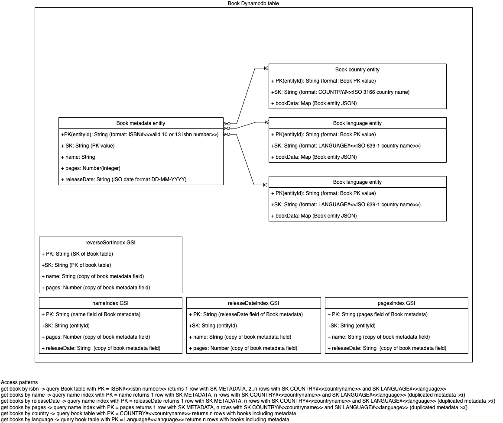

# Welcome to the Books-api CDK TypeScript project

This project implements a book api to implement a REST resource based API.

## Business requirements

## Functional requirements

* The client (the entity making the requests) MUST be able to: add one or more items, remove an item for a table, and query the items still remaining for a table.
* The application MUST, upon update request, store the item with all updated fields, except `isbn`.
* The application MUST, upon creation request, store the item with all the fields.
* The application MUST, upon deletion request, remove a specified item for a specified `isbn`.
* The application MUST, upon query request, show all items for a specified filter.
* The application MUST accept at least 10 simultaneous incoming add/remove/query requests.

Some key points to take in mind when doing this:

Do all use cases need to be handled (in the same way) by the admin or the end-user.

* Which data should (not) be shared
* How are exceptions handled & mapped
* Consistency in the specifications
* Backward compatibility

```json
{
   "name": "<name of the book>",
   "isbn": "<universal identifier of the book>",
   "authors": "<authors of the book>",
   "languages": "<languages the book is available>",
   "countries": "<countries where the book is available>",
   "numberOfPages": "<number of pages of the book>",
   "releaseDate": "<release date of the book>",
}
```

## Datamodel

TODO: Update model with author entity and incorporate bookData



## Non functional requirements

* All errors should be handled and mapped accordingly
  * Client errors - Errors due to the request where a request correction could fix the issue will return a HTTP error 4xx
  * Server side errors should all be responding with a HTTP error 5xx describing the error. No stacktraces should leak out meaning that all errors should be mapped to a meaningfull description
  * All errored request should conforming to the following Json schema draft 4 spec:

  ```json
  {
    "$schema": "https://json-schema.org/draft-04/schema",
    "id": "errorMessageBody",
    "title": "Schema for error message",
    "type": "object",
    "required": [
        "errorMessage"
    ],
    "properties": {
        "errorMessage": {
            "type": "string"
        }
    }
  }
  ```

## Note

* You can use any language you feel more comfortable with, but we have a preference for `Typescript` for the CDK part and `Python` for any runtime routine. (For the runtime Typescript was also used)

## Architecture

Based on the requirements the architecture will be a Serveless based solution using the following main components:

* Aws Appsync
  * Choosen based on the requirements to filter items on a filter specification allowing for maximum filtering capabilities out of the box.
* AWS DynamoDB
  * Choosen for the simple use case of one entity and based on the identified access patterns and good integration with AppSync
* AWS Cognito


## Toolkit and libraries used

The `cdk.json` file tells the CDK Toolkit how to execute your app.

### Useful commands

* `npm run build`   compile typescript to js
* `npm run watch`   watch for changes and compile
* `npm run test`    perform the jest unit tests
* `cdk deploy`      deploy this stack to your default AWS account/region
* `cdk diff`        compare deployed stack with current state
* `cdk synth`       emits the synthesized CloudFormation template
